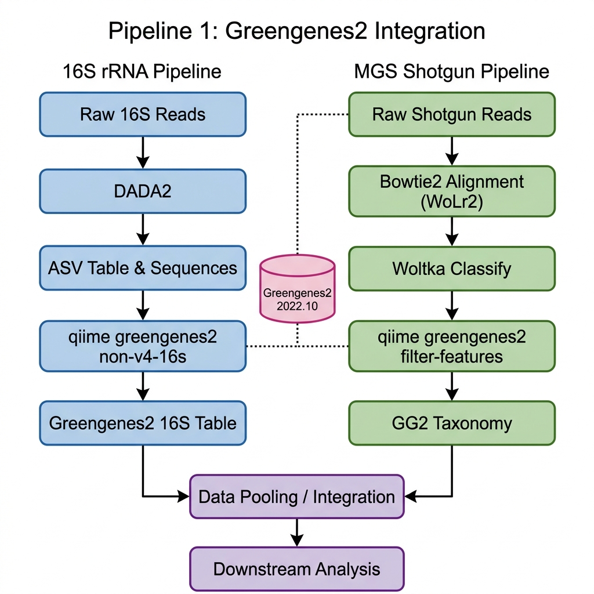

# Pipeline 1: Integrated Taxonomy Workflow

This document outlines the standard operating procedure for **Pipeline 1**, which uses **Greengenes2** as the common reference to pool 16S and Metagenomic Shotgun (MGS) data.

## Workflow Visualization

## Key Implementation Steps

### 1. 16S Harmonization
- **Purpose**: Map amplicon sequence variants (ASVs) to the Greengenes2 reference tree.
- **Key Command**: `qiime greengenes2 non-v4-16s` or `qiime greengenes2 filter-features`.

### 2. MGS Alignment
- **Requirement**: Reads must be aligned against **Web of Life version 2 (WoLr2)** genomes.
- **Tool**: Bowtie2 or similar aligner.

### 3. MGS Feature Generation
- **Tool**: **Woltka** classifies the alignments based on the WoL phylogeny, which is congruent with Greengenes2.

### 4. Cross-Study Merging
- Once both tables are processed through `q2-greengenes2`, they share the same Feature IDs and Taxonomic strings, allowing for direct merging using `qiime feature-table merge`.
