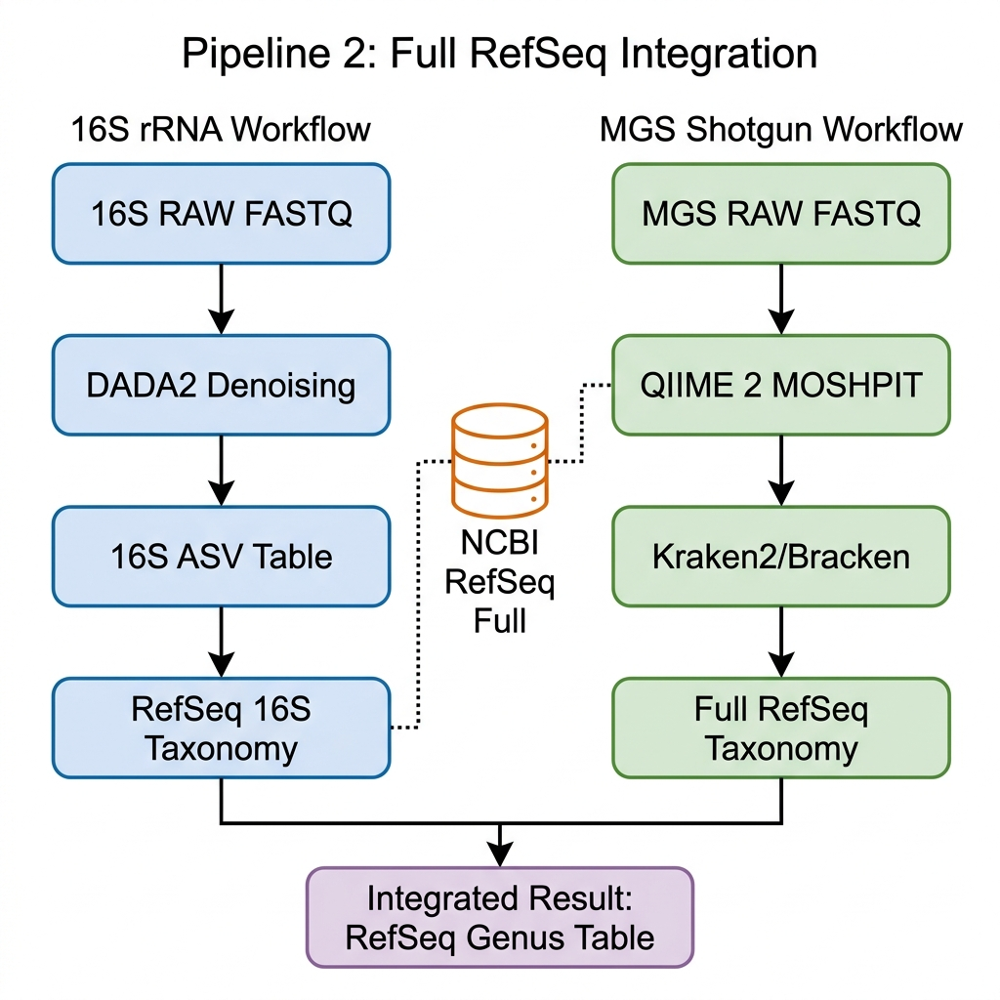

# Pipeline 2: Full RefSeq Integration

This pipeline uses the **NCBI RefSeq (full)** database as a common reference for both 16S and MGS data.

## Workflow Visualization

## Step-by-Step Instructions

### 1. 16S rRNA Processing (RefSeq)
- **Tool**: QIIME 2 / DADA2
- **Goal**: Align sequence reads to the **RefSeq 16S** subset.
- **Method**: Standard denoising with DADA2 followed by taxonomic classification using `qiime feature-classifier`.

### 2. Shotgun Metagenomics Processing (RefSeq)
- **Tool**: QIIME 2 MOSHPIT (Kraken2/Bracken)
- **Goal**: Classify all metagenomic shotgun reads against the **Full NCBI RefSeq** database.
- **QC**: Use **Bracken** for abundance estimation at the genus level.

## References
- [MOSHPIT Documentation](https://bokulich-lab.github.io/moshpit-docs/chapters/03_taxonomic_classification/reads.html)
- [Kraken2 GitHub](https://github.com/DerrickWood/kraken2)
