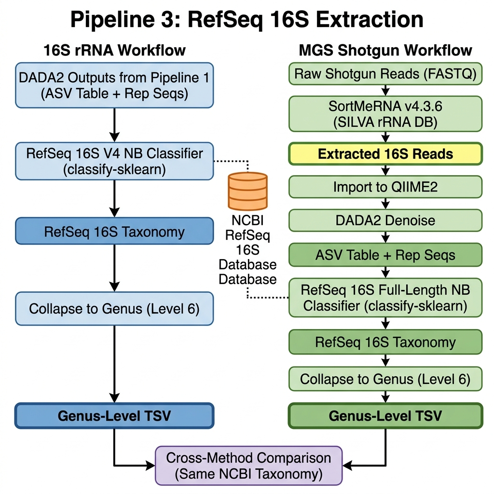

# Pipeline 3: RefSeq 16S Extraction

This pipeline extracts 16S rRNA reads from shotgun data and classifies them using the **same NCBI RefSeq 16S database** used on the 16S amplicon side, ensuring identical taxonomy labels for cross-method comparison.

## Workflow Visualization

## Step-by-Step Instructions

### 16S rRNA Workflow

> Reuses DADA2 outputs (`dada2_table.qza`, `rep_seqs.qza`) from Pipeline 1.

1. **RefSeq 16S V4 NB Classifier** — Classify the Pipeline 1 ASVs against the NCBI RefSeq 16S V4 Naive Bayes classifier (`refseq16s_V4_nb.qza`) using `qiime feature-classifier classify-sklearn`.
2. **Collapse to Genus** — Collapse the ASV table to genus level (level 6) using `qiime taxa collapse`.
3. **Export TSV** — Export genus-level table to TSV via `biom convert`.

### MGS Shotgun Workflow

1. **SortMeRNA v4.3.6** — Extract 16S rRNA reads from shotgun FASTQs using SortMeRNA with the SILVA rRNA database (`--paired_in --out2`). Submitted via SLURM sbatch (32 GB / 8 CPUs per job).
2. **Import to QIIME2** — Create a manifest from extracted 16S FASTQ pairs and import into QIIME2 as `SampleData[PairedEndSequencesWithQuality]`.
3. **DADA2 Denoise** — Denoise extracted 16S reads (`--p-trunc-len-f 0 --p-trunc-len-r 0`, no truncation since these are random 16S fragments, not amplicon reads).
4. **RefSeq 16S Full-Length NB Classifier** — Classify ASVs against the NCBI RefSeq 16S full-length Naive Bayes classifier (`refseq16s_fullLength_nb.qza`) using `qiime feature-classifier classify-sklearn`.
5. **Collapse to Genus** — Collapse to genus level (level 6) using `qiime taxa collapse`.
6. **Export TSV** — Export genus-level table to TSV via `biom convert`.

### Cross-Method Comparison

Both genus-level TSV files use **identical NCBI taxonomy labels** (`k__Bacteria; p__...; g__...`):
- `results/pipeline3/16S/otu_table_genus.tsv` — 16S amplicon side (V4 classifier)
- `results/pipeline3/MGS/otu_table_genus.tsv` — MGS extracted-16S side (full-length classifier)

> **Note:** The V4 and full-length classifiers are trained on the same 26,244 dereplicated RefSeq 16S sequences with identical NCBI taxonomy, so genus labels match exactly.

## References
- [SortMeRNA GitHub](https://github.com/sortmerna/sortmerna)
- [NCBI RefSeq 16S](https://www.ncbi.nlm.nih.gov/refseq/targetedloci/)
